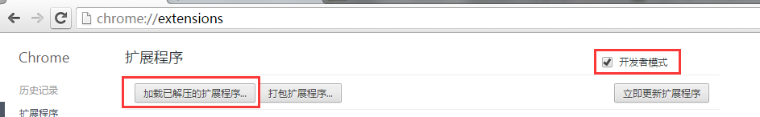
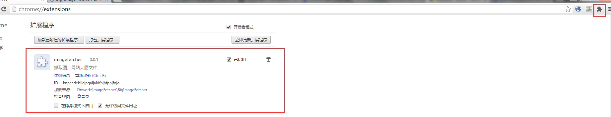
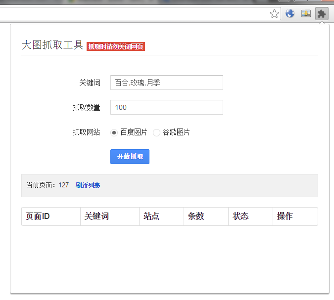
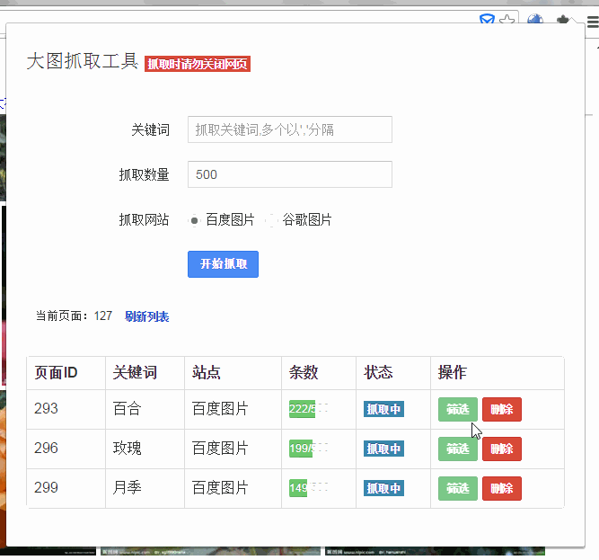
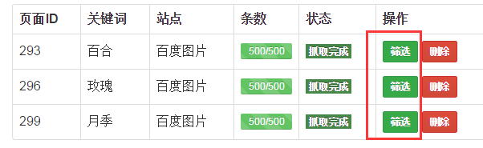
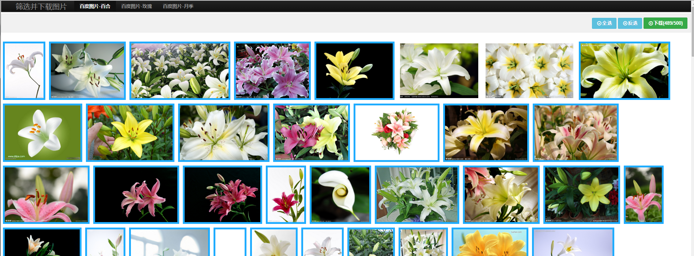
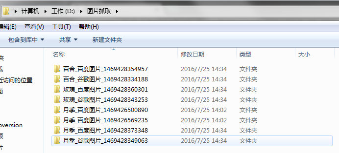

#安装插件
##step1.
下载插件BigImageFetcher.zip。解压插件，得到BigImageFetcher文件夹。
（由于chrome浏览器的安全设置，现在已经不允许安装未发布的打包插件了，所以需要自己解压安装~）
##step2.
打开chrome浏览器，在地址栏输入`chrome://extensions/`

选中开发者模式，点击`加载已解压的扩展程序`，选中刚刚解压得到的目录。

插件列表中出现imagefetcher，右上角出现插件图标，说明插件加载成功

#使用插件
##开始抓取
点击上图中右上角的插件图标，输入抓取参数

- 关键词可以输入多个，以逗号分隔，关键词为汉字、字母，不要出现特殊字符，否则可能导致下载失败
- 抓取数量为抓取图片个数，抓取到指定张数后即为完成本次抓取
- 抓取网站是选择抓取图片来源站点，目前支持百度图片和谷歌图片的抓取

设置好参数后点开始抓取，若设置了3个关键词，此时会自动打开3个浏览器窗口，注意不要关闭这些浏览器窗口

##抓取结果
窗口打开完毕后，再次打开插件界面，可以看到下载进度

##筛选和下载
抓取完毕后，点击`筛选` 可以进入筛选、下载图片界面

筛选完毕之后点击右上角下载，会出现这个窗口

这里注意，一定要点击`打开chrome下载设置`，进去设置一下下载路径，并取消勾选‘下载器询问每个文件的保存位置’，如果不取消勾选的话，会弹出很多确认窗口，导致电脑卡死。

## 下载结果
下载完成后，会在设定的下载目录下生成以关键词、站点、时间戳命名的文件夹

里边就是下载下来的大图了

结束。